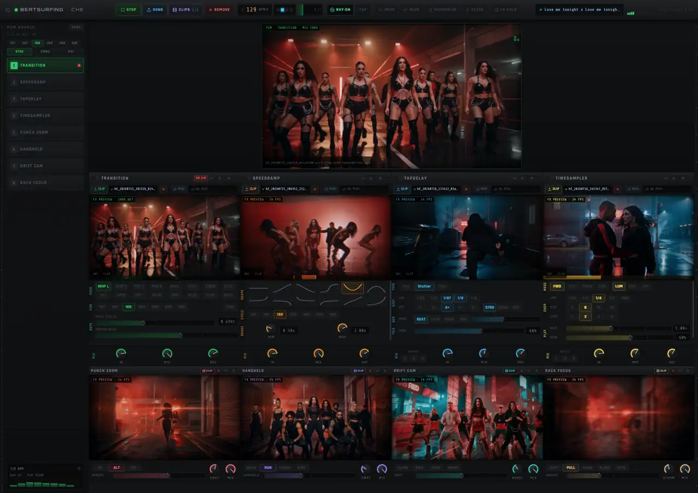

# Beat Surfer Pro

<p align="center">
  
</p>

Browser-native **audio-reactive video FX rack** with a broadcast-style program monitor. Load clips into eight modules, cut on the beat, and drive shader effects from live rhythm analysis — **SvelteKit 5 + WebGPU only** (no React, no Three.js fallback).

`#vj` `#beat-sync` `#webgpu` `#webcodecs` `#svelte` `#vite` `#bun` `#realtime-video` `#shader-fx` `#audio-reactive` `#music-video` `#program-monitor` `#singlefile`

## Quick start

```bash
bun install          # installs svelte/ deps via postinstall hook — or: cd svelte && bun install
bun run dev          # http://localhost:5174
bun run test         # vitest
bun run test:local   # full local suite (unit + build + browser gates)
bun run build        # single-file → svelte/build/
```

### QA mode (auto-load 8 clips + song)

```bash
bun run link-qa      # symlink 8 MP4s + Redline from ~/Downloads/archive (2)
bun run dev
open 'http://localhost:5174/?qa=1&qaAutoplay=1'
```

On every refresh, `?qa=1` auto-loads Redline + 8 rack clips via [`svelte/src/lib/qa/loadQaMedia.ts`](svelte/src/lib/qa/loadQaMedia.ts).

## Stack

| Layer | Tech |
|-------|------|
| UI | SvelteKit 5 + runes |
| Render | **WebGPU only** (WGSL) — one `WebGpuEngine` rAF loop |
| Decode | WebCodecs + shared video pool |
| Rhythm | Essentia hosted analysis + Web Audio fallback |
| Audio FX | SoundTouch.js (KEY / PITCH / TEMPO) |
| Build | Vite 8 + Bun → single HTML via `vite-plugin-singlefile` |

## Project structure

```text
svelte/src/
  routes/+page.svelte       Main rack layout
  lib/audio/                AudioEngine, Essentia, SoundTouch
  lib/rendering/webgpu/     WebGpuEngine, WGSL registry, VideoTextureCache
  lib/runtime/pgm/          Beat-quantized PGM director
  lib/modules/catalog.ts    FX module catalog (18 modules, drag-from-palette)
  lib/components/           TopBar, EffectModule, PgmRail, ModulePalette…
  lib/qa/                   QA auto-load + window.__BSP_QA__ hooks
docs/                       Architecture notes, hero screenshot
```

## Docs

- [`svelte/README.md`](svelte/README.md) — ship gate checklist, verify scripts
- [`svelte/docs/LOCAL_TESTING.md`](svelte/docs/LOCAL_TESTING.md) — browser acceptance gates
- [`svelte/docs/MODULES.md`](svelte/docs/MODULES.md) — register new effects
- [`CLAUDE.md`](CLAUDE.md) — module param reference

## Requirements

- **Chrome / Edge 113+** or **Safari 18+** with WebGPU enabled
- **Bun** for installs and scripts
