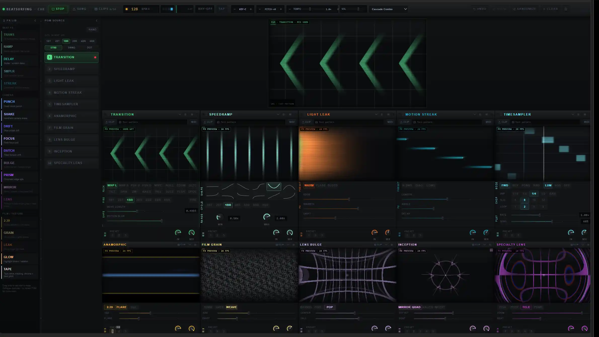

# Beatsmaxxer Pro

<p align="center">
  
</p>

Browser-native **audio-reactive video FX rack** with a broadcast-style program
monitor. Load clips into eight modules, cut on the beat, and drive shader
effects from live rhythm analysis — **SvelteKit 5 + WebGPU only** (no React,
no Three.js or WebGL fallback).

**Live:** [beatsmaxxing.com](https://beatsmaxxing.com) ·
**Windows app:** [latest release](https://github.com/gordo-v1su4/beatsmaxxer-pro/releases/latest)

## What it does

- **Perform** — eight live clip slots, 19 WGSL effect modules, and a program
  (PGM) monitor that cuts on the beat.
- **Arrange** — song sections detected from the track, laid out as a timeline.
- **Timing** — speed ramps, stutters and jump cuts locked to the beat grid.
- **MIDI** — load a `.mid` file to drive trigger modules note by note.
- **Audio** — hosted Essentia rhythm/structure analysis with a Web Audio
  fallback; independent KEY / PITCH / TEMPO via SoundTouchJS.
- **Everywhere** — the same build runs in desktop Chrome/Edge, as a one-clip
  performance shell on phones, and as a Windows desktop app (Tauri 2).

## Quick start

```bash
bun install          # also installs svelte/ via postinstall
bun run dev          # http://localhost:5174
bun run test         # vitest
bun run test:local   # unit + build + browser gates (needs Chrome + WebGPU)
bun run build        # static site → svelte/build/
bun run dev:desktop  # Windows desktop shell (Tauri)
```

### QA mode (auto-load 8 clips + a song)

```bash
cd svelte && bash scripts/setup-qa-media.sh
bun run dev
# open http://localhost:5174/?qa=1&qaAutoplay=1
```

`?qa=1` auto-loads the song and eight rack clips on every refresh via
[`loadQaMedia.ts`](svelte/src/lib/qa/loadQaMedia.ts). Committed WebM fixtures
work on any machine.

## Stack

| Layer | Tech |
|-------|------|
| UI | SvelteKit 5 + runes |
| Render | **WebGPU only** (WGSL) — one `AppLoop` rAF drives `WebGpuEngine` |
| Decode | 8 slot-owned `HTMLVideoElement` pipelines in a shared pool; PGM reuses one |
| Rhythm | Hosted Essentia analysis + Web Audio fallback |
| Audio FX | SoundTouchJS (KEY / PITCH / TEMPO) |
| Desktop | Tauri 2 shell around the same web build (Windows) |
| Build | Vite 8 + Bun → static site via `@sveltejs/adapter-static` |

## Project structure

```text
svelte/src/
  routes/+page.svelte       Root page — picks the rack or the mobile shell
  lib/audio/                AudioEngine, Essentia, SoundTouch
  lib/rendering/webgpu/     WebGpuEngine, WGSL shaders and registry
  lib/runtime/              AppLoop, PGM director, timing and media runtimes
  lib/modules/catalog.ts    FX module catalog
  lib/components/           Rack, Arrange and Timing workspaces
  lib/mobile/               Phone performance shell
  lib/qa/                   QA auto-load + window.__BMX_QA__ hooks
desktop/                    Tauri 2 shell (Windows)
docs/                       Backlog, research, timing-workspace notes
```

## Docs

- [`docs/README.md`](docs/README.md) — docs index (backlog, research, workspace notes)
- [`svelte/docs/ARCHITECTURE.md`](svelte/docs/ARCHITECTURE.md) — runtime ownership and render/media data flow
- [`svelte/docs/SHIP_PLAN.md`](svelte/docs/SHIP_PLAN.md) — implemented work versus required release evidence
- [`svelte/docs/LOCAL_TESTING.md`](svelte/docs/LOCAL_TESTING.md) — browser acceptance gates
- [`svelte/docs/MODULES.md`](svelte/docs/MODULES.md) — register new effects
- [`desktop/README.md`](desktop/README.md) — desktop build and releases
- [Portfolio case study](docs/portfolio-case-study/README.md) — interactive architecture walkthrough

## Roadmap

### Shipped

- [x] WebGPU-only render engine — WGSL shaders, no WebGL fallback
- [x] Eight-slot clip rack with live previews and a program (PGM) monitor
- [x] Beat-quantized PGM cuts with no flash frame (arm-at-trim + `requestVideoFrameCallback`)
- [x] 19 effect modules — drag from the palette, hot-swap without a reload
- [x] Hosted Essentia rhythm and structure analysis, with a Web Audio fallback
- [x] KEY / PITCH / TEMPO on the music track (SoundTouchJS)
- [x] MIDI files drive trigger modules note by note
- [x] Arrange view seeded with the song's detected sections
- [x] Timing workspace — speed ramps, stutters and jump cuts on the beat grid
- [x] Phone performance shell — one clip, swipeable module cards
- [x] Windows desktop app with auto-updates ([v0.2.7](https://github.com/gordo-v1su4/beatsmaxxer-pro/releases/latest))
- [x] PIN access gate and hosted deploy at [beatsmaxxing.com](https://beatsmaxxing.com)
- [x] Browser acceptance gates and physical visual-proof capture

### In progress — sequencer and arrangement ([#25](https://github.com/gordo-v1su4/beatsmaxxer-pro/issues/25))

- [x] Arm the sequencer to cut PGM from a 16-step pattern
- [ ] Timeline lines up exactly with the song after analysis
- [ ] Edit sections, banks and cut patterns in Arrange
- [ ] REC PGM clips and effect trigger marks, then commit them to cuts
- [ ] Loop a section to rehearse it in Perform and Arrange
- [ ] Section clip buckets — Intro, Verse, Chorus draw from their own clips ([#26](https://github.com/gordo-v1su4/beatsmaxxer-pro/issues/26))

### Next

- [ ] Preset clips — ready-made clip packs that load into the rack in one click
- [ ] Automated time remapping — ramps and stutters that follow the song's sections on their own
- [ ] macOS desktop app — same web path as the Windows build
- [ ] iPhone app — native shell around the phone performance view

## Requirements

- **Chrome / Edge 113+** or **Safari 18+** with WebGPU enabled
- **Bun** for installs and scripts

## License

[MIT](LICENSE). Third-party code keeps its own license — notably
[SoundTouchJS](https://github.com/cutterbl/SoundTouchJS) (MPL-2.0) by Steve
"Cutter" Blades, based on Olli Parviainen's [SoundTouch](https://www.surina.net/soundtouch/).
See [`THIRD_PARTY_NOTICES.md`](THIRD_PARTY_NOTICES.md).
