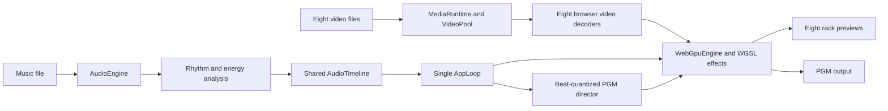

# Beat Surfer Pro: Technical Overview

## What the application does

Beat Surfer Pro is a browser-based live video performance tool. A user can load up to eight video clips and a music track, apply real-time effects, and switch a final **program output (PGM)** in time with the music. The interface resembles a broadcast effects rack: every clip has a preview and one selected result appears in the larger PGM monitor.

It is designed for live VJ-style playback and beat-synchronized visuals without rendering a finished video first. The app analyzes the music, keeps every clip on one transport clock, and uses the GPU to process each visible frame.

The app has no normal application backend. Video decoding, audio playback, timing, interaction, and graphics rendering run locally. An optional development-only Essentia service can improve rhythm analysis; otherwise the app uses local Web Audio analysis.

## User-facing workflow

1. Load a song; the app determines BPM, beat positions, and frequency energy.
2. Load videos into the eight rack slots.
3. Assign and adjust effects while watching each live preview.
4. Send a slot to PGM immediately or on a beat boundary.
5. PGM reuses that slot's decoded video and renders its effect as the final view.

The 19 registered effects cover beat-driven transitions and time manipulation, virtual camera moves, and film treatments such as grain, light leaks, halation, anamorphic framing, and VHS distortion.

## Core technology

| Area | Implementation |
|---|---|
| User interface | Svelte 5 and SvelteKit, written in TypeScript |
| Development/build | Vite 8 and Bun |
| GPU rendering | Native WebGPU with custom WGSL shaders |
| Video playback | Browser `HTMLVideoElement` decoding and a shared video pool |
| Audio playback | Web Audio API |
| Pitch and tempo | SoundTouch audio worklet |
| Rhythm detection | Optional hosted Essentia analysis with local Web Audio fallback |
| Distribution | Static, single-file browser build |

There is no Three.js or WebGL fallback. WebGPU is the only graphics path; initialization failure produces a clear capability error.

## Runtime architecture

The architecture uses one authoritative clock and one animation loop. `AudioTimeline` derives transport position from the active `AudioContext`. On each frame, `AppLoop` publishes one timing snapshot containing playback time, BPM, beat phase, playback rate, and discontinuities. Audio updates, video seeking, effect parameters, sequencing, PGM scheduling, and GPU rendering consume the same snapshot, preventing separate parts of the app from drifting onto different clocks.

### Media ownership

The rack has eight stable slots: four upper and four lower. A slot owns its video file, object URL, video element, decoder state, and cached frame. Its assigned effect is separate and owns shader selection, parameters, bypass state, and MIDI behavior.

Changing an effect therefore does not reload or duplicate the video. A clip replacement is prepared and decoded before it replaces the current source; the old video and object URL are released only after the new frame is ready.

PGM does not create a ninth decoder. It references one of the eight source slots, reducing memory and decoder pressure while keeping preview and final output tied to the same source.

### WebGPU rendering

All preview and PGM canvases share one `GPUDevice`. For each frame, the engine imports the browser-decoded image as a short-lived `GPUExternalTexture`, binds the appropriate WGSL pipeline, renders into a feedback texture, and blits the result to the canvas.

Feedback effects swap between two textures each frame. Timeline state tells the renderer when to advance or reset them after playback, seek, or loop changes. Missing sources render an idle/test-card state.

Effects are data-driven. The module catalog defines each effect's name, row compatibility, defaults, and shader key. Registering metadata and WGSL code makes a new effect appear in the FX library automatically.

### Audio and beat synchronization

`AudioEngine` owns the music element, `AudioContext`, gain, frequency analyzers, and SoundTouch processor. It exposes full-spectrum, bass, and high-frequency energy for audio-reactive motion.

An explicitly enabled same-origin proxy can call Essentia with a bounded audio upload. Returned BPM, musical key, confidence, and beat grid are validated. In production, the server-side credential is protected by same-origin request validation, strict upload limits, and an IP-keyed Vercel WAF rate limit. When Essentia is unavailable, playback remains local and realtime analysis provides fallback timing.

SoundTouch separates tempo, pitch, and musical-key transposition, allowing playback speed to change without automatically shifting pitch.

## Important source areas

| Path | Responsibility |
|---|---|
| `svelte/src/routes/+page.svelte` | Main application startup, layout, and shutdown |
| `svelte/src/lib/runtime/AppLoop.ts` | Sole production animation loop |
| `svelte/src/lib/transport/AudioTimeline.ts` | Shared transport and beat timing |
| `svelte/src/lib/audio/AudioEngine.ts` | Audio playback, processing, and analysis state |
| `svelte/src/lib/runtime/media/MediaRuntime.ts` | Clip assignment and replacement lifecycle |
| `svelte/src/lib/media/VideoPool.ts` | Ownership of the eight live video elements |
| `svelte/src/lib/rendering/webgpu/WebGpuEngine.ts` | GPU setup, frame submission, and canvas rendering |
| `svelte/src/lib/rendering/webgpu/shaders/` | WGSL effect implementations |
| `svelte/src/lib/runtime/pgm/PgmDirector.ts` | Immediate and beat-quantized PGM selection |
| `svelte/src/lib/modules/catalog.ts` | Effect registry and default rack configuration |

## Build and operating constraints

The static production build is written to `svelte/build/`, with assets inlined by the single-file Vite plugin. Bun handles installs, development, tests, and builds; local development runs at `http://localhost:5174`.

Visual acceptance needs Chrome on a physical WebGPU-capable machine. Unit tests and builds can run without a GPU, but the full browser proof loads eight videos, confirms PGM decoder reuse, watches playback and GPU telemetry, cycles through the effect catalog, checks drift and dropped frames, and captures visual evidence. Code tests alone cannot prove that realtime decoding, audio synchronization, and GPU rendering work smoothly together.
