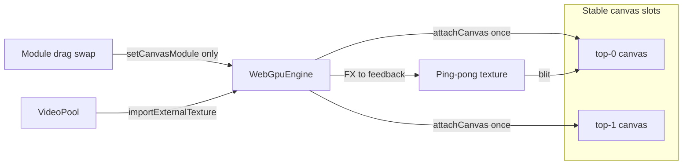

# Architecture: what we're NOT using (and why canvas code is correct)

Your question points at [`WebGpuEngine.ts`](svelte/src/lib/rendering/webgpu/WebGpuEngine.ts) — `attachCanvas`, `setCanvasModule`, and the `canvasPass` blit. **That code is intentional.** The rewrite did **not** say "no HTML canvas." It said **no Three.js / no WebGL fallback.**

## What we are NOT using (Svelte rewrite)

| Dropped | Old React path | Why |
|---------|----------------|-----|
| **Three.js** | `THREE.WebGLRenderer` per module in [`src/components/EffectModule.tsx`](src/components/EffectModule.tsx) | Single `WebGpuEngine` + WGSL instead |
| **WebGL / GLSL in browser** | Hand-written GLSL fragment shaders (~200–400 lines each) | Port progressively to WGSL in [`moduleFx.wgsl.ts`](svelte/src/lib/rendering/webgpu/shaders/moduleFx.wgsl.ts) |
| **WebGL fallback** | Silent downgrade when WebGPU missing | [`CapabilityGate`](svelte/src/lib/components/CapabilityGate.svelte) blocks app — WebGPU-only |
| **Canvas remount on drag** | Re-create renderer when module swaps | **Slot-stable** IDs (`top-0`…`bottom-3`); only `moduleId` changes via `setCanvasModule` |
| **Full SoundTouch envelope UI** | N/A (external studio) | Plan: 4 top-bar controls only (KEY / PIT / TMP / VOL) |
| **PresetBrowser in side rail** | Plan Phase 4 said remove | **Note:** cloud merge **restored** it in [`+page.svelte`](svelte/src/routes/+page.svelte) after your feedback — macros also remain in top bar |

## What we ARE using (this is correct)

- **`HTMLCanvasElement` + `getContext('webgpu')`** — required WebGPU presentation surface ([`WebGpuCanvas.svelte`](svelte/src/lib/components/WebGpuCanvas.svelte))
- **One GPU attach per slot** — pipelines/bindings created in `attachCanvas`
- **Hot-swap logic** — `setCanvasModule(canvasId, moduleId)` updates which effect renders into that slot (plan item `p2-stutter-gate`: "slot-stable canvas + hot-swap during play")
- **Ping-pong feedback** → offscreen pass → **blit to canvas** (lines ~364–383 in `WebGpuEngine.ts`)

So: **not Three.js canvas; yes native WebGPU canvas.**

## Why you can't see the original plan

The ship plan exists only as a Cursor artifact:

- [`.cursor/plans/beat_surfer_ship_gate_1b8af462.plan.md`](.cursor/plans/beat_surfer_ship_gate_1b8af462.plan.md)
- Never committed to git (`.cursor/` was untracked during cloud work)
- Cursor Plans panel in IDE often does not show cloud-agent plans
- Cloud copy lived at `/opt/cursor/artifacts/plans/` (not on your Mac)

Related docs that **are** in repo today:
- [`svelte/README.md`](svelte/README.md) — "No Three.js, no WebGL fallback"
- [`README.md`](README.md) — stack table
- [`svelte/docs/LOCAL_TESTING.md`](svelte/docs/LOCAL_TESTING.md) — test commands only

## Proposed doc commits (after you approve)

1. **Copy plan → [`svelte/docs/SHIP_PLAN.md`](svelte/docs/SHIP_PLAN.md)**
   - Full content from `.cursor/plans/beat_surfer_ship_gate_1b8af462.plan.md`
   - Update stale bits (branch now `feat/svelte-rewrite` @ `918e18f`, PresetBrowser restored, local testing added)
   - Link from [`svelte/README.md`](svelte/README.md) Docs section

2. **Add [`svelte/docs/ARCHITECTURE.md`](svelte/docs/ARCHITECTURE.md)** (short, ~1 page)
   - "Use / Don't use" table (above)
   - Canvas slot lifecycle diagram
   - Pointer to legacy React app in `src/` for GLSL reference only

3. **Fix README inconsistency**
   - [`svelte/README.md`](svelte/README.md) line 80 says "PresetBrowser removed" but [`+page.svelte`](svelte/src/routes/+page.svelte) mounts it again — align checklist with current UI intent (your call: keep PresetBrowser or remove per original plan)

No code changes to `WebGpuEngine` required — the canvas/blit path matches the plan.
