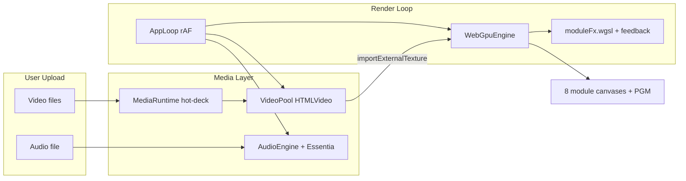

# Beatsmaxxer Pro — Honest Ship Plan

## What is actually true today


| Claim in README / prior work           | Reality                                                                                                                                                                                                                                                                                                                                                                                             |
| -------------------------------------- | --------------------------------------------------------------------------------------------------------------------------------------------------------------------------------------------------------------------------------------------------------------------------------------------------------------------------------------------------------------------------------------------------- |
| "Built" / cutover checklist mostly [x] | **Overstated.** Most items are wired in code but **not browser-verified** with real clips + audio.                                                                                                                                                                                                                                                                                                  |
| Videos load into modules               | **Broken or unproven** in your session. Local fixes (blob `crossOrigin`, offscreen video size) exist on `feat/svelte-rewrite` but are **uncommitted** and never validated in Chrome with WebGPU.                                                                                                                                                                                                    |
| All shaders present                    | **No.** Svelte has one simplified WGSL file (`[svelte/src/lib/rendering/webgpu/shaders/moduleFx.wgsl.ts](svelte/src/lib/rendering/webgpu/shaders/moduleFx.wgsl.ts)`). React has **per-module GLSL** with ping-pong feedback, 16 transition types, real tapdelay trails, loop-seam hold, etc. (`[src/components/EffectModule.tsx](src/components/EffectModule.tsx)` ~2100+ lines of shader strings). |
| Deployed on Vercel                     | **No — still the old React app.** Root `[vercel.json](vercel.json)` runs `bun run build` → `dist/` (React). Svelte lives in `[svelte/](svelte/)` and is **not** what Vercel builds.                                                                                                                                                                                                                 |
| On `main`                              | **No.** `main` @ `06c3458` (React). Rewrite is `feat/svelte-rewrite` @ `3153749` + large uncommitted diff.                                                                                                                                                                                                                                                                                          |
| Browser tested                         | **Barely.** `[svelte/scripts/verify-ui.sh](svelte/scripts/verify-ui.sh)` only checks HTTP 200 + text strings (`BEATSURFING`, `TRANSITION`). **No video pixels, no audio, no beat assertions.**                                                                                                                                                                                                      |
| Unit tests = app works                 | **No.** 60 Vitest tests cover transport math, timesampler reducer, speedramp curve — **zero** Playwright/CDP/browser tests in `svelte/`.                                                                                                                                                                                                                                                            |


React repo **does** have real acceptance scripts the Svelte rewrite never ported:

- `[scripts/browser-playback-acceptance.ts](scripts/browser-playback-acceptance.ts)` — QA media, PGM leaves static, renderer path
- `[scripts/ui-interaction-acceptance.ts](scripts/ui-interaction-acceptance.ts)` — controls clickable under load

**You are correct: there is no proof — no screenshots of playing video, no audio verification, no stutter/latency gate.**

---

## Reference work for SoundTouch (Phase 4 — after core works)

Hand off to implementing agent:


| Resource                     | Path                                                                                                                                                                       | Notes                                                                                                |
| ---------------------------- | -------------------------------------------------------------------------------------------------------------------------------------------------------------------------- | ---------------------------------------------------------------------------------------------------- |
| SoundTouch studio            | `[/Users/robertspaniolo/Documents/audio-ui-curves/soundtouch-envelope-studio](/Users/robertspaniolo/Documents/audio-ui-curves/soundtouch-envelope-studio)`                 | **dist-only** in repo (no `src/`). May need to recover source from git history or rebuild from spec. |
| Original envelope timeline   | `[/Users/robertspaniolo/Documents/audio-ui-curves/custom-sound-envelope-timeline (1)](/Users/robertspaniolo/Documents/audio-ui-curves/custom-sound-envelope-timeline (1)`) | Has envelope curve UI (`App.tsx`); not the 4-knob transport UI.                                      |
| Integration architecture doc | `docs/BEATSMAXXER_SOUNDTOUCH_INTEGRATION.md`                                                                                                                                | **Not found** in `audio-ui-curves` — must be written or supplied before integration.                 |
| UI layout spec               | `docs/BEATSMAXXER_SOUNDTOUCH_UI_LAYOUT.md`                                                                                                                                  | **Not found** — same.                                                                                |


**User intent for SoundTouch:** only **4 instant-reactive controls** (pitch, tempo, key, volume) in the **top bar** near BPM — Suno-style key stepper, not the full envelope studio UI. These must also drive **video** (`playbackRate`, pitch via shader or processing chain). **Remove** the left `[PresetBrowser](svelte/src/lib/components/PresetBrowser.svelte)` panel (too crowded); relocate 8 module-colored macro dots elsewhere later.

---

## Architecture: what must work (video-first)




**Known video breakages to fix first:**

1. `[VideoPool.ts](svelte/src/lib/media/VideoPool.ts)` — `crossOrigin` on blob URLs blocks GPU readback; offscreen video was 1×1px (fix started locally, needs commit + test).
2. `[WebGpuEngine.encodeBinding](svelte/src/lib/rendering/webgpu/WebGpuEngine.ts)` — `hasReadyFrame` gate may keep `hasVideo=0` if metadata/play never completes; need user-gesture play + `loadedmetadata` wait + visible error state in UI.
3. `[WebGpuCanvas.svelte](svelte/src/lib/components/WebGpuCanvas.svelte)` — canvas attaches on mount; if engine init races or WebGPU unavailable, previews stay black with only a small toast (`[CapabilityGate.svelte](svelte/src/lib/components/CapabilityGate.svelte)`).
4. No **diagnostic surface** — user cannot tell "clip attached but GPU failed" vs "no clip loaded".

---

## Phase 1 — P0: Video + audio actually work (block everything else)

### 1A Fix video attach pipeline

- Commit and harden VideoPool fixes (blob CORS, 640×360 offscreen, `loadedmetadata` + `canplay`, explicit `video.load()`).
- On clip upload (`[+page.svelte](svelte/src/routes/+page.svelte)` `setModuleVideo`, CLIP button, drag-drop): show **per-module status** (loading / ready / error) in patch bay or preview badge.
- Expose debug hook on `window.__BSP_QA__` for acceptance scripts: `{ clipsLoaded, hasReadyFrame per module, webgpu, beatPhase }`.
- Ensure `[AppLoop](svelte/src/lib/runtime/AppLoop.ts)` always pushes params; video optional for idle, required for `hasVideo=1`.

### 1B Fix audio + Essentia on dev and production

- Dev: keep Vite proxy `[/__api](svelte/vite.config.ts)` → `essentia.v1su4.dev`.
- Production: set `VITE_ESSENTIA_API_BASE_URL` in Vercel env (direct HTTPS — no dev proxy in static build).
- TopBar upload must show `RHY·OK` or explicit error — not silent failure.

### 1C Browser acceptance suite (NEW — this is the proof you asked for)

Port React CDP scripts into `svelte/scripts/`:


| Script                  | What it proves                                                                                                                      | Artifacts                     |
| ----------------------- | ----------------------------------------------------------------------------------------------------------------------------------- | ----------------------------- |
| `verify-playback.ts`    | QA clips load into all 8 slots; `hasReadyFrame` true; PGM canvas non-black pixel sample; audio `playing=true`; `beatPhase` advances | JSON report + PNG screenshots |
| `verify-interaction.ts` | While playing: drag module, tweak knobs/sliders, swap clip — **no uncaught errors**, frame time p95 under budget                    | log + screenshot              |
| `verify-stutter.ts`     | 30s play: sample `video.currentTime` delta vs wall clock; detect seeks >50ms except timesampler; RAND PGM cuts don't blank PGM      | metrics JSON                  |


Wire in `[svelte/package.json](svelte/package.json)`:

```bash
bun run verify:playback   # mandatory gate
bun run verify:interaction
bun run verify:all          # playback + interaction + unit tests + build
```

**Manual proof checklist (agent must attach to PR):**

- Screen recording: upload 4+ clips + Redline mp3, play 60s, collapse rows, drag modules, no freeze
- Screenshots: each module preview showing **actual video frames** (not black grid)
- Console: zero WebGPU texture errors

---

## Phase 2 — P1: Shader parity (real FX, not placeholders)

Current WGSL is a **single stub** with beat-pulse approximations. Port from React in priority order:

1. **Shared infrastructure:** ping-pong feedback textures per canvas (React already solves loop-seam whiteout — port that logic).
2. **Per-module shaders** (or shader `#ifdef` modes with full bodies):
  - `transition` — 16 move types + interval zones
  - `tapdelay` — feedback delay line + stutter/MIDI
  - `timesampler` — slice jumps synced to `[getLiveScheduleFrame](svelte/src/lib/audio/AudioEngine.ts)`
  - `speedramp` — rate meter + streak (rate from `[speedramp.ts](svelte/src/lib/runtime/speedramp.ts)`)
  - Camera row: punch, shake, orbit, focus
3. **Idle graphics** — param-reactive lower-band animations (React `moduleIdle`); already started in WGSL, expand to match React.

**Gate:** side-by-side screenshot diff vs React QA session for each module with test pattern + with clip.

---

## Phase 3 — P2: Performance / zero-stutter requirements

Acceptance thresholds (adjust after baseline run):

- Preview rAF: **≥55 fps** median while all 8 modules + PGM rendering
- Video `playbackRate` changes (speedramp): no full-frame seek except timesampler
- Module drag-swap during play: **no canvas remount** (slot-stable IDs `top-0`… already started in `[+page.svelte](svelte/src/routes/+page.svelte)`)
- Hot clip swap: old video stays until new `hasReadyFrame` (already in VideoPool attach — verify in `verify-interaction`)

---

## Phase 4 — P3: UI cleanup + SoundTouch (after video+shaders pass)

- **Remove** left `[PresetBrowser](svelte/src/lib/components/PresetBrowser.svelte)` panel from `[+page.svelte](svelte/src/routes/+page.svelte)` side rail (keep FX LIB + PGM only).
- **Top bar** (`[TopBar.svelte](svelte/src/lib/components/TopBar.svelte)`): compact transport strip —
  - BPM (editable, tap tempo)
  - Key (Suno-style stepper / click-to-cycle, not a slider)
  - Pitch / Tempo / Volume — 4 minimal controls from SoundTouch spec (once docs exist)
  - Instant apply to `AudioEngine` + `videoPool.setModuleRate` / global pitch uniform
- **Mix strip:** smaller knobs (done), no duplicate knob rows on compact modules (done)
- **8 macro dots:** move out of removed preset panel → bottom of top bar or collapsible strip; colors match rack modules (`[presets.ts](svelte/src/lib/stores/presets.ts)` `RACK_MACRO_DEFS`)

---

## Phase 5 — P4: Vercel production cutover (only after Phase 1–3 gates)

Update root `[vercel.json](vercel.json)`:

```json
{
  "installCommand": "cd svelte && bun install",
  "buildCommand": "cd svelte && bun run build",
  "outputDirectory": "svelte/build"
}
```

Set Vercel env: `VITE_ESSENTIA_API_BASE_URL=https://essentia.v1su4.dev`

**Merge `feat/svelte-rewrite` → `main` only when:**

- `bun run verify:all` passes locally
- Screen recording + screenshots attached
- Production preview URL manually checked on Chrome + Safari (WebGPU)

---

## Definition of Done (what "finished" means)

The app is **not** done until ALL of these pass:

- [ ] Upload video via CLIP, drag-drop, and top-bar bulk load → **visible motion in every loaded module preview**
- [ ] Upload mp3 → **audible playback** + `RHY·OK` or documented fallback
- [ ] All 8 modules + PGM show **real shader FX** on clips (not just grid test card)
- [ ] Beat-synced modules (transition, tapdelay, timesampler, speedramp) **align to bar** at known BPM (133 Redline QA)
- [ ] Play 60s while adjusting every knob/slider, dragging modules, swapping clips → **no stutter, no black hold >200ms**
- [ ] Automated `verify:playback` + `verify:interaction` pass in CI/local
- [ ] `bun run build` produces deployable single-file bundle
- [ ] Vercel production serves Svelte build, Essentia works via env URL
- [ ] README cutover checklist rewritten to match **verified** state only

---

## Immediate next steps for implementing agent

1. **Do not mark anything done** until `verify:playback` produces screenshots with real video frames.
2. Commit uncommitted video-pipeline fixes; add `__BSP_QA__` debug API.
3. Port `[browser-playback-acceptance.ts](scripts/browser-playback-acceptance.ts)` to target Svelte dev server + WebGPU engine state.
4. Fix whatever fails in that script first — that is the real backlog, not UI polish.
5. Only then: shader port, SoundTouch top bar, preset panel removal, Vercel cutover.

