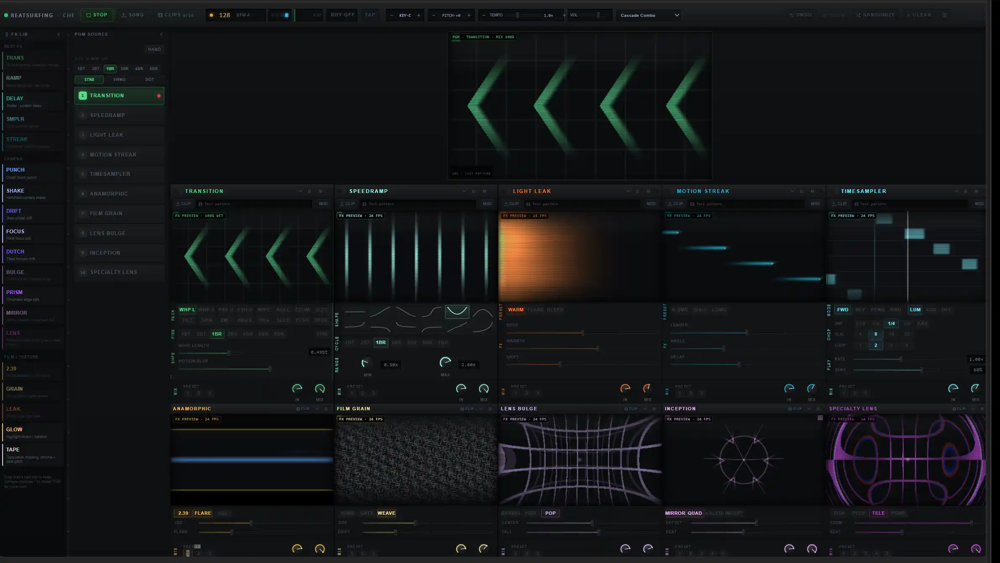

# Beatsmaxxer Pro — Svelte + WebGPU

<p align="center">
  
</p>

Browser-native audio-reactive video FX rack built with **SvelteKit 5** and **WebGPU/WGSL only**. The app has no WebGL or Three.js fallback.

**Release status: blocked pending physical-browser evidence.** The implementation is not a proved release until the headed real-media gate produces a valid report and PNG artifacts. See [the ship plan](docs/SHIP_PLAN.md).

## Commands

Run these commands from `svelte/`:

```bash
bun install
bun run dev          # http://localhost:5174
bun run check        # svelte-check
bun run test         # Vitest
bun run build        # production build -> build/
bun run test:local   # unit, build, browser, and required physical-proof verification
bun run verify:browser
```

From the repository root, `bun run dev`, `bun run check`, `bun run test`, `bun run build`, and `bun run test:local` delegate to this package.

## QA mode

Start the app and open:

```text
http://localhost:5174/?qa=1&qaAutoplay=1
```

`?qa=1` loads the committed QA manifest through [`loadQaMedia.ts`](src/lib/qa/loadQaMedia.ts). QA fixtures exercise automation paths; they do not replace the required physical proof with staged real MP4 and MP3 files.

## Architecture

| Area | Current implementation |
|---|---|
| Renderer | Native WebGPU, task-scoped external video textures, WGSL FX, feedback ping-pong, final blit |
| Canvas lifecycle | Stable rack canvas IDs attach once; `setCanvasModule()` hot-swaps module assignment |
| PGM | Stable `pgm` canvas with dedicated `setPgmLiveModule()` source selection |
| Timing | One `AudioTimeline` based on `AudioContext.currentTime`; one `AppLoop` rAF |
| Media | Eight stable slot-owned video elements; candidate prewarm, transactional replacement, explicit release |
| Audio | Web Audio, SoundTouch worklet controls, optional consent-gated hosted rhythm analysis |
| QA | `window.__BSP_QA__`, automated gates, and a separate physical headed release-proof gate |

Read [docs/ARCHITECTURE.md](docs/ARCHITECTURE.md) for ownership and data flow.

## Documentation

- [Architecture](docs/ARCHITECTURE.md) — WebGPU, timeline, canvas, PGM, and media lifecycle invariants
- [Ship plan](docs/SHIP_PLAN.md) — implemented work versus required release evidence
- [Local testing](docs/LOCAL_TESTING.md) — automated and browser gate workflow
- [Module development](docs/MODULES.md) — catalog and shader registration
- [Audio analysis](docs/ESSENTIA.md) — hosted-analysis consent and configuration

## Stack

- Svelte 5 and SvelteKit
- Vite 8 and Bun
- WebGPU and WGSL
- Web Audio and `@soundtouchjs/audio-worklet`
- Vitest plus CDP-based browser verification
